## How to:  add a ringtone

### Computer

#### Find out what you have on the computer

* Open iTunes
* Click where it says Music (just under the play button) 

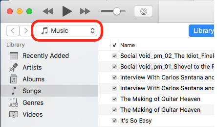 

* Select Tones from the dropdown menu.  If it's not on the menu, do Edit Menu..

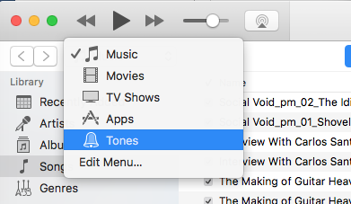

I currently have three ringtones (though when I started on this project I didn't have any on this computer).

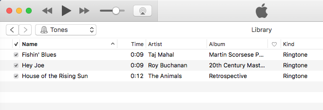

The actual files are in 

```bash
Music/iTunes/iTunes\ Media/Tones
```

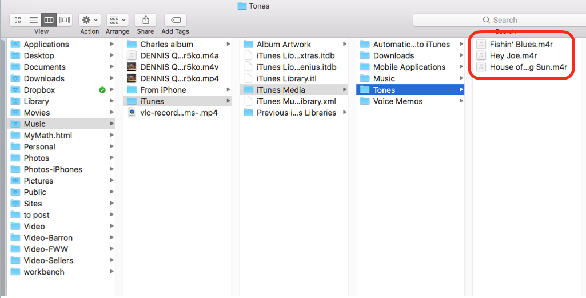

The file extension for my ringtones is .m4r.

The header looks similar but not identical to an .m4a file that is an authentic AAC file.

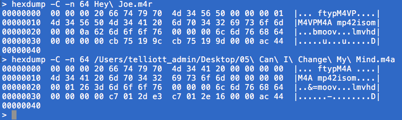

<hr>

#### Add a new ringtone to iTunes

If you want the new ringtone to be copied into your iTunes library, under iTunes > Preferences, click the Advanced tab

* Make sure "Copy files when adding.." is checked

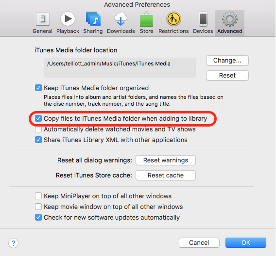

* Do File > Add to Library ..

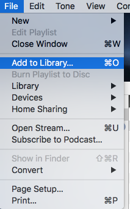

* Navigate to the music file in the Finder window that is presented, and click to add

#### Formats

Ringtones are supposed to be AAC format ([Advanced Audio Coding](https://en.wikipedia.org/wiki/Advanced_Audio_Coding)).

To convert an MP3 file to AAC, first add the MP3 file to iTunes.  With the song selected do File > Convert > Create AAC Version

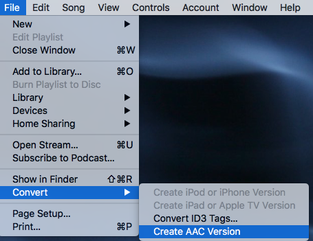

#### Making a new ringtone from a longer song

For a demo, I chose a Roy Buchanan song:  Sweet Dreams.  The first part is very slow, so I want my ringtone to start at the 15th second and go for 30 seconds more.

I used the open source VLC media player because I already have it and use it for video (but see below for instructions for iTunes).

[website](http://www.videolan.org/vlc/index.html)

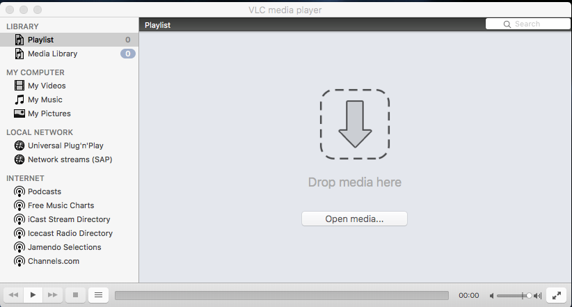

Just drag and drop the song file.

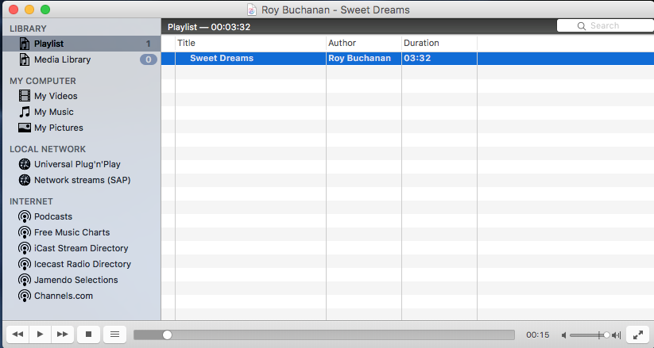

Drag the time to where you want to start

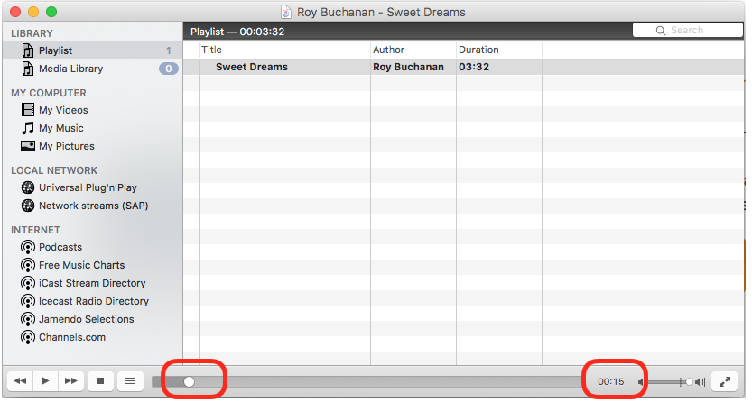 

Do Playback > Record.

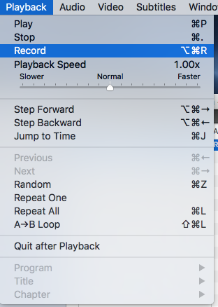

Nothing will happen until you start playing the song.  Let it play for 30 seconds, then stop it.  (The limit is said to be 40 seconds).  

The audio snippet will be at the top level in the Music directory as an .mp4 file.  Just change the file extension to .m4r.

Follow the instructions above to add it to the iTunes library.

#### Using iTunes

I learned today that iTunes can do this.

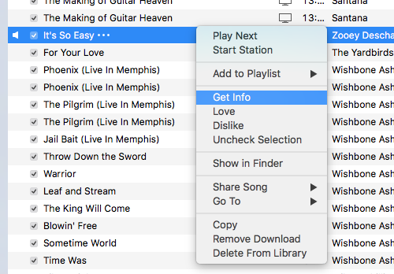

Control-click ("right"-click) on the song and do Get Info.  

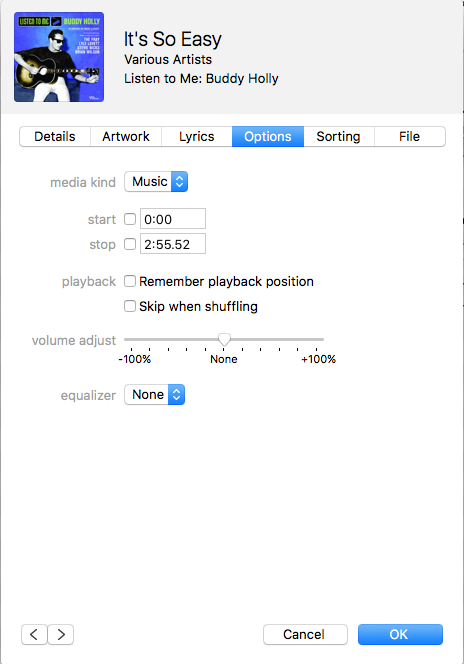

Under Options, you can set a start and stop time for the song.  (Note: this only works from within iTunes).

Then do File > Convert > Create AAC Version.  


When I did this I thought I was hosed, because only one version of the song showed up in iTunes.

It appears to be the shortened version as you can see by the time that shows in the window at the top (this is misleading as well).

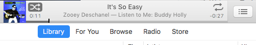

Just to be safe, I had already dragged the original song from iTunes out onto my Desktop.

In any event, control-click on the song again in iTunes and do Show In Finder, then drag the short version onto the Desktop.  You will know it by its title, which has `` 1`` added before the ``.m4a``.

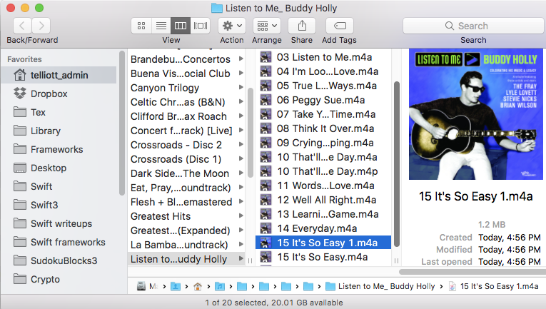 

Change the file extension to be ``.m4r`` and get rid of the `` 1``.  At this point, I dragged the file into iTunes onto the Tones thingie and it just showed up.

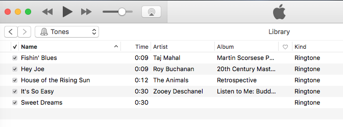 
 
More good advice is [here](https://computers.tutsplus.com/tutorials/quick-tip-create-ringtones-in-itunes-for-free--mac-46032)

As for the original song, you will want to de-select the start and stop icons on the Options tab to restore it to the original condition.

Make sure to keep the copy we made in case you find something wrong with the file or playback, but I think it it looks fine.

### iPhone

#### What's on the iPhone now?

You can view (and listen to) all the ringtones that are on the iPhone under Settings > Sounds.

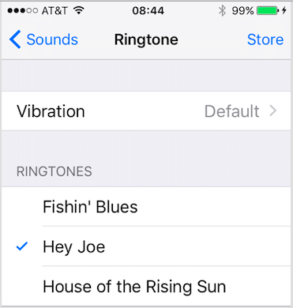 

#### Settings

As far as I know you cannot send music from the computer to the iPhone directly, by file transfer and have it play.  You can transfer a music file but iTunes on the phone won't add it or play it.  There are apparently third-party apps that do.

So the way we get a new ringtone on your phone is how all your other music got there, by syncing.

I am not real familiar with issues around syncing so be careful.  As they say, [YMMV](http://www.urbandictionary.com/define.php?term=ymmv).  

For example, I accidentally erased all my music on the phone in working this out.  Luckily it's on the computer (and back up hard drives).

Also note:  I sync very little over iCloud, so I don't know what difference that would make.  I am going to sync manually by a USB cable.

<hr>

#### Sync

Anything that can be synced can be borked.

Plug the iPhone into the computer using the USB cable.

Dismiss the iPhotos nagware alert by clicking the red close button.

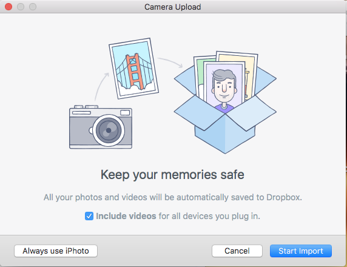

The iPhone shows up in the iTunes navigation sidebar under Devices.  The figure shows the phone as it used to be when I started this morning.  

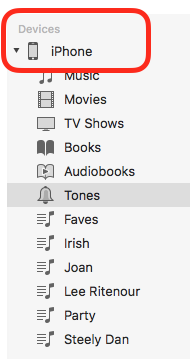 
 
Those playlists got erased but we'll make sure they are back on the phone when we're done.

Click the disclosure triangle and select Tones to see the ringtones that are on the phone.  I have three of them.

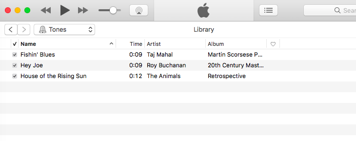

Next, click the phone symbol at the top of the iTunes window.  This is where we tell iTunes *how* we want to sync the phone.

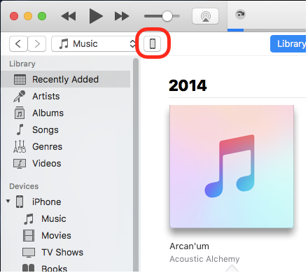

The sidebar changes to show something like this:  

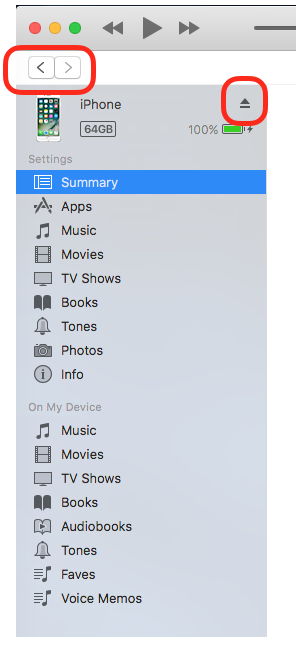

If you want to go back to the previous view without ejecting the phone, click the back button (outlined in red on the left above).

To eject or un-mount the phone, click the other button.

### I discover the trick

The trick is that these views under Settings are **not like normal views**.

Here we have Tones selected in the sidebar.  

You can make changes, but you do not have to click *either* button in the lower right part of the view.  We need to make sure that all the settings are right before we do this.

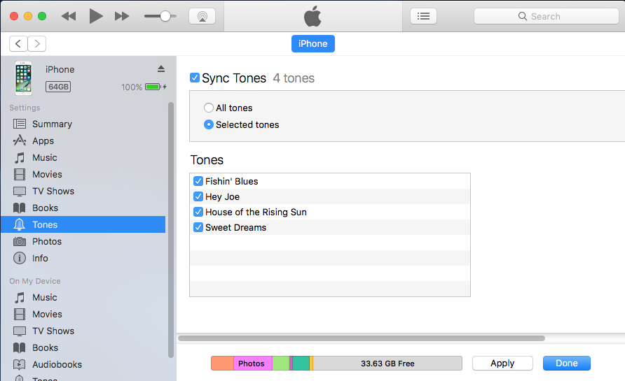

In fact, if you click Done it will lead you right away to Apply and syncing, but that's another story.

Just make sure all the Tones are selected.

So the trick here is to make sure we have the right stuff selected to sync before we fool with the sync settings.

Now, select Music in the sidebar

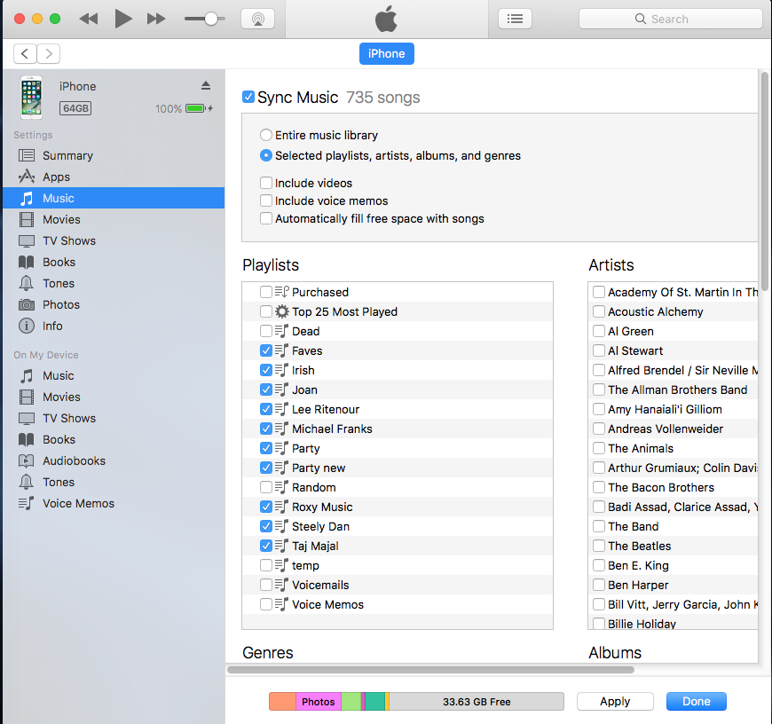

I click on those playlists that I lost before.  If any other section has Sync checked, make sure the settings are correct.  Do not click any button in the lower right-hand corner.

With Summary selected in the sidebar, under Options, I click on Sync only selected songs.

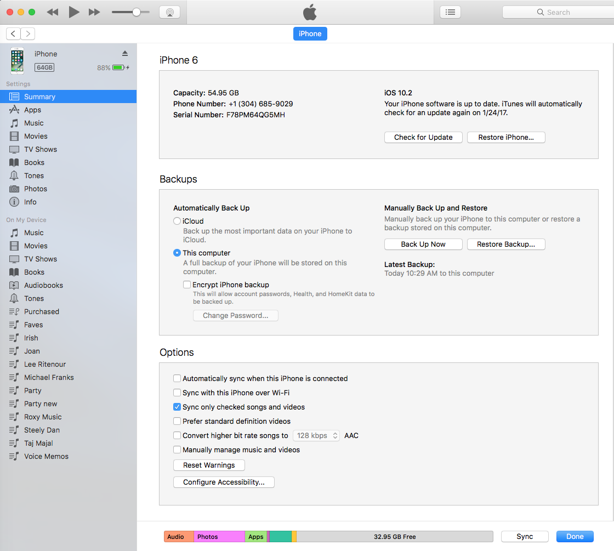 

Now I finally click the Sync button in the lower right.  I get an alert:

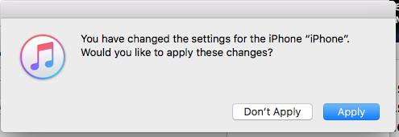

If I click **Apply**, we will start syncing.  

Unfortunately, if I press **Don't Apply**, iTunes will forget the settings I just changed and kick me out of this view back to the standard view.  I guess they really meant **Cancel**.

That's just crazy bad UI design.

This time, I click Apply.  And we sync.  It takes a while.

When we're finished syncing, I click the phone icon again.

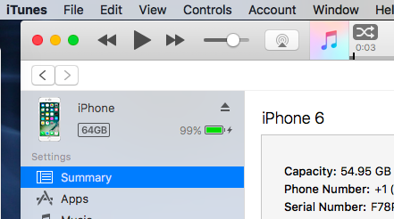

I check Music (it's good), and Tones (it's good except I forgot to check the box for the other new Tone so it didn't sync.

I check the box and click Done and we sync for a short time to just copy the ringtone and it looks good.  I think.


